# Bad Avatar Builder – Xbox 360 Setup Guide

> [!WARNING]
> 
> **Back up your NAND before proceeding.** This process modifies your Xbox 360's software environment. A NAND backup lets you restore your console to its original state if anything goes wrong. Without one, a failed or botched exploit may leave your console unrecoverable. Search for NAND backup tutorials specific to your Xbox 360 model before continuing.

## 1. Requirements

### PC
- 64-bit Windows 10 or 11
- File archiver: [7-Zip](https://www.7-zip.org) or WinRAR
- [.NET Runtime 8](https://dotnet.microsoft.com/en-us/download/dotnet/8.0) or newer
- USB flash drive *(will be formatted — back up any data on it first)*

### Xbox 360
- Firmware version **2.0.17559.0** — check via **Settings > System Info**
  - If needed, update via USB: [Xbox 360 System Updates](https://support.xbox.com/en-US/help/xbox-360/console/system-updates-info) → *How to update* → *Copy to a USB flash drive*
- **Auto sign-in disabled**: Settings → Profile → Sign-in Preferences

## 2. Creating the Bad Avatar USB Flash Drive

### Preparation

1. Download `Aurora 0.7b.2 - Release Package.rar` from [phoenix.xboxunity.net](https://phoenix.xboxunity.net/#/news), extract it, and rename the folder to **`Aurora`**.
2. Download `Bad_Avatar-Builder_x64.zip` from the [GitHub Releases page](https://github.com/5T33Z0/Bad_Avatar_Builder/releases) and extract it.
3. Plug in your USB flash drive.

### Running the Builder

4. Double-click `Bad_Avatar-Builder.exe`.
5. Press **Enter** at the welcome screen:<br>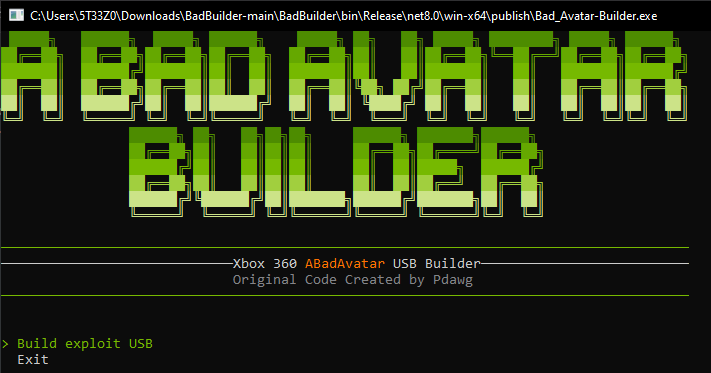
6. Select your USB flash drive from the list and press **Enter**:<br>
7. Type `y` and press **Enter** to confirm formatting:<br>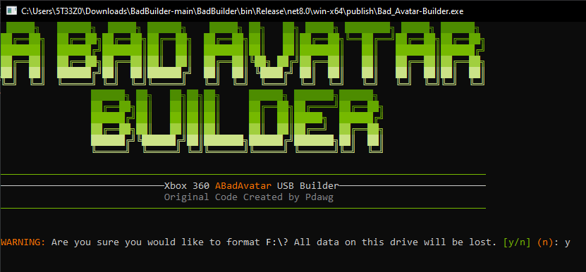
8. Press **Enter** to begin downloading required files:<br>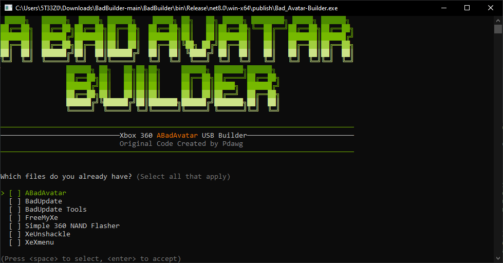
9. Wait for all necessary files to download:<br>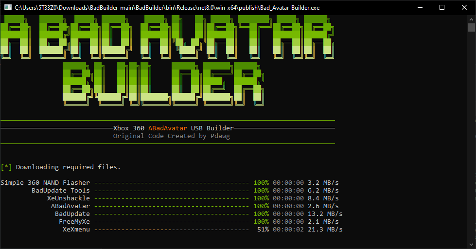
10. Select your exploit — **XeUnshackled** is recommended — and press **Enter**:<br>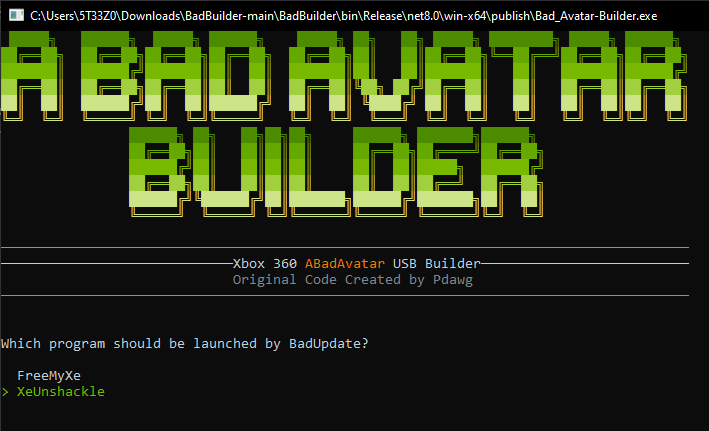
11. Wait for the process to complete:<br>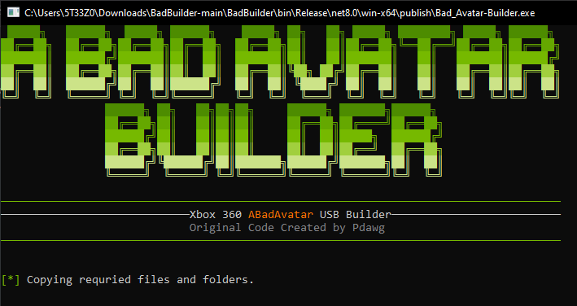
12. Type `y` and press **Enter** to add Homebrew programs:<br>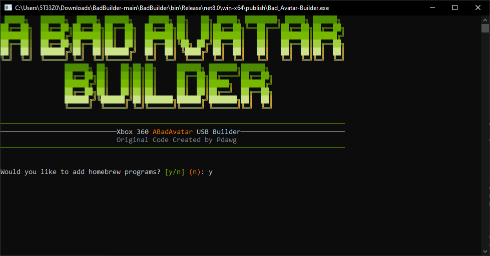
13. Open File Explorer, navigate to your **`Aurora`** folder, and copy the full path from the address bar (double-click the address bar):<br>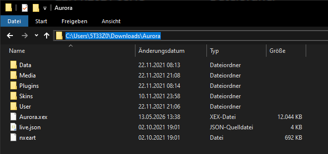
14. Paste the path into the Command Prompt window and press **Enter**:<br>
15. Use the **↓ arrow key** to highlight **Finish & Save** and press **Enter**:<br>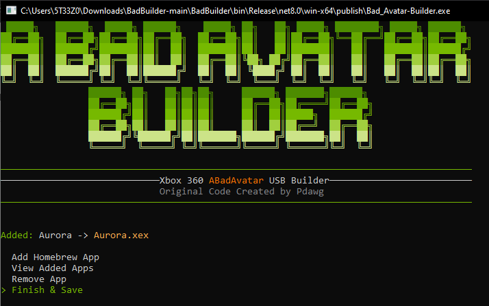
16. Wait for the files to be copied to the USB flash drive:<br>

### Configuring `launch.ini`

17. Open the root of the USB flash drive in File Explorer and open **`launch.ini`** in Notepad or any text editor:<br>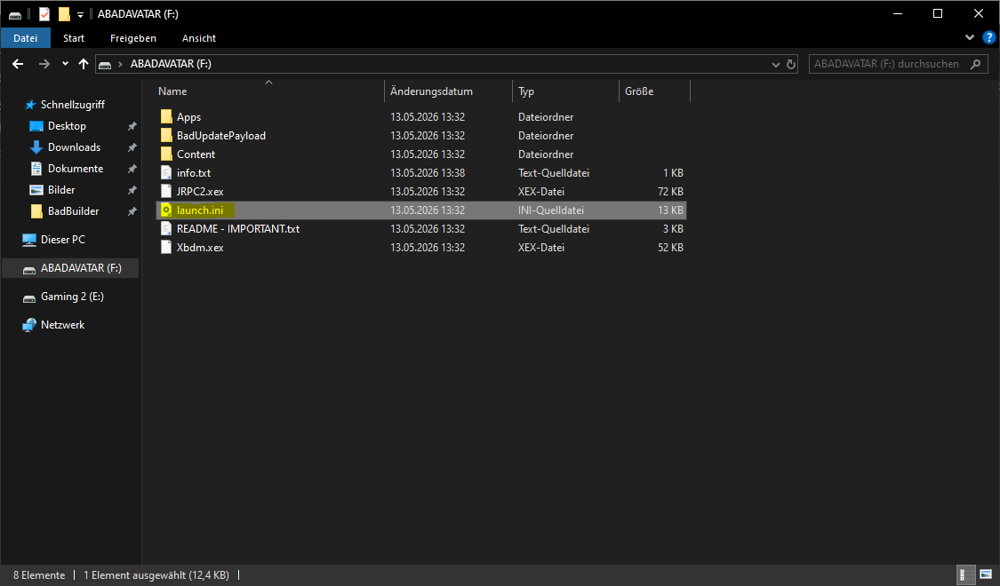
18. On **line 37**, find the `Default =` entry and set it to:
    
    ```
    Usb:\Apps\Aurora\Aurora.xex
    ```
    **Screenshot**: <br> 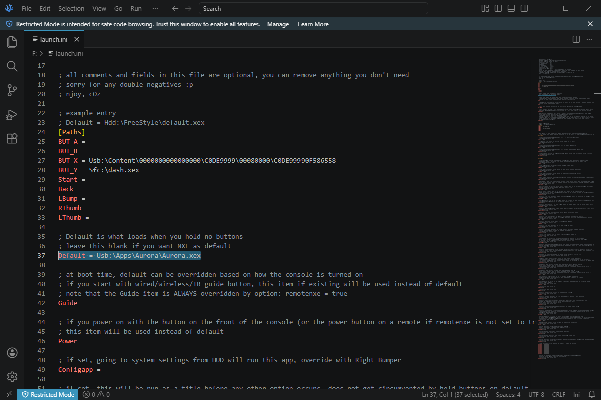
19. Save the file. The USB drive is ready.

## 3. Applying the Exploit

1. Safely eject the USB flash drive from your PC.
2. Insert it into a USB port on your Xbox 360.
3. Power on the console and wait — the exploit typically takes 10 seconds to about a minute.
4. A success animation will appear on screen when the exploit completes:<br>
5. Press the **Back** button on your controller to continue loading into the Aurora Dashboard.

## 4. Configuring the Aurora Dashboard

With your Xbox 360 now unshackled, set up Aurora to browse and launch content. Two resources:

- **Written guide**: [Xbox 360 Bad Avatar / Bad Builder Guide (2026)](https://itemlevel.net/xbox-360-abadavatar-badbuilder-guide-in-2026/#setting-up-your-aurora-dashboard)
- **Video tutorial**: [MrMario2011 on YouTube](https://www.youtube.com/watch?v=S4xyqbkK51w&t=2368s)
